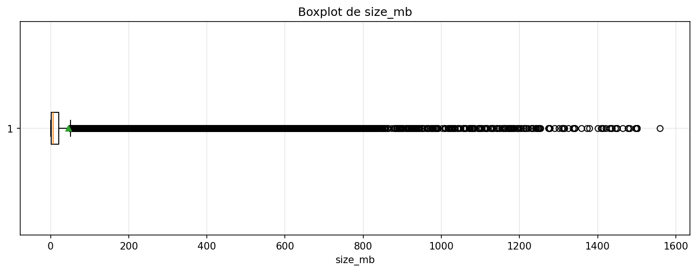
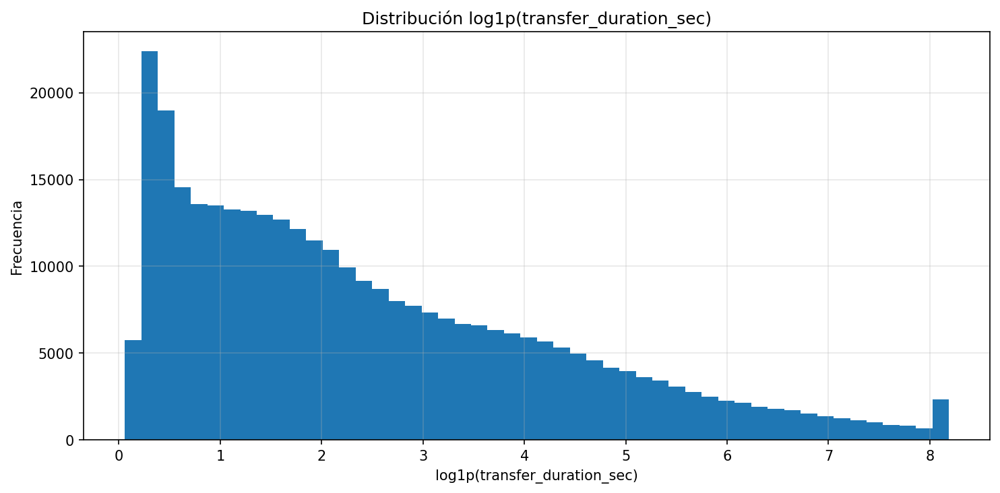
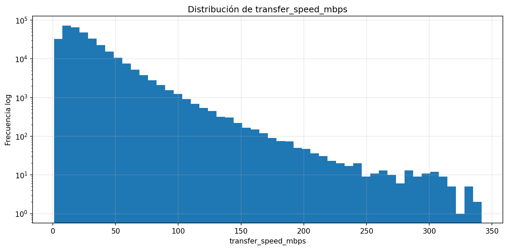
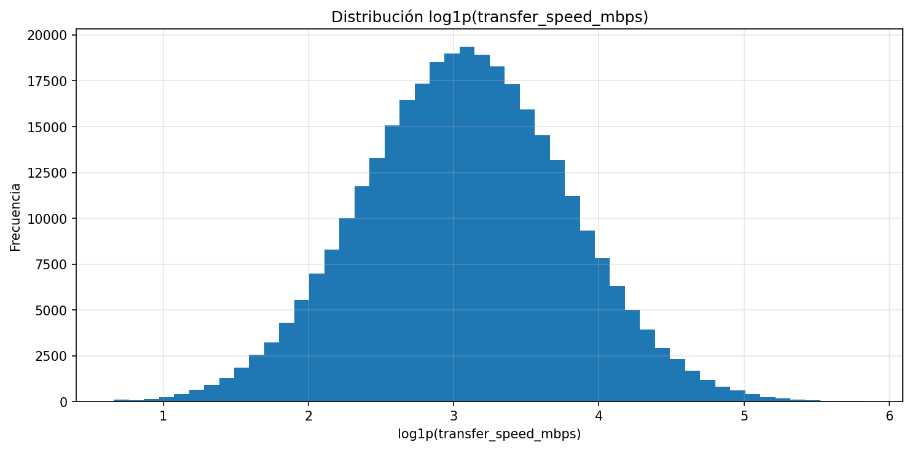
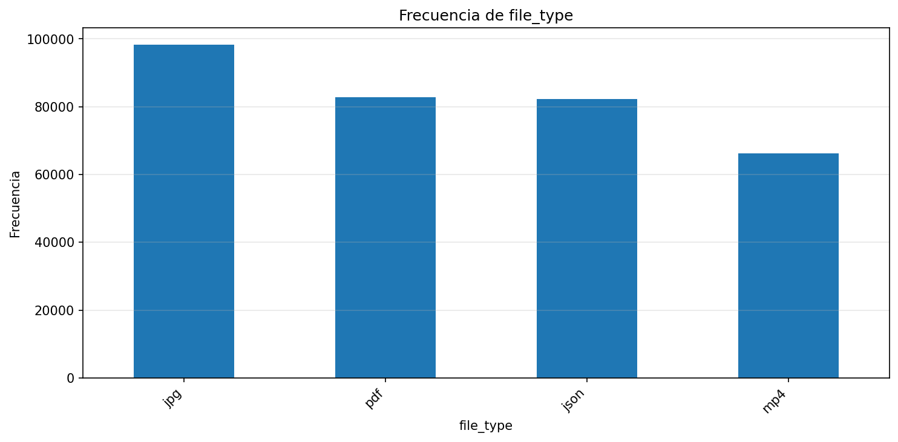
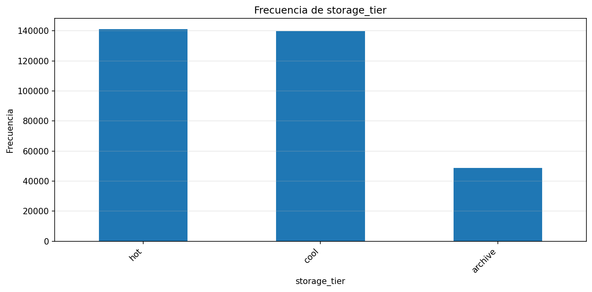
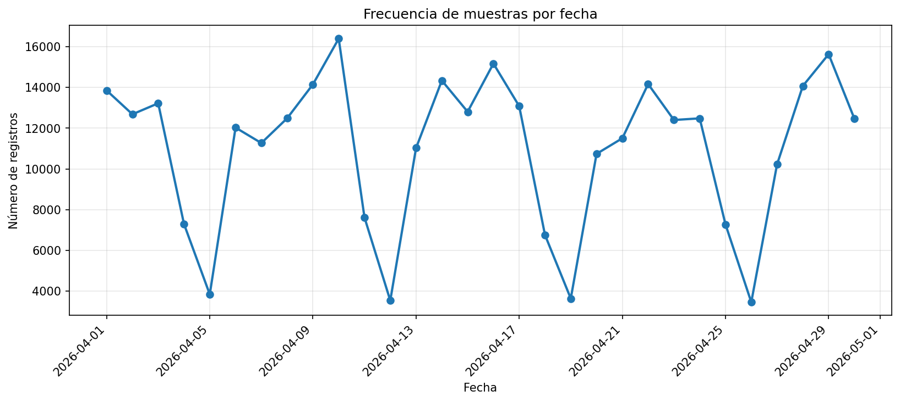

🏠 [Inicio](../README.md)

⬅️ [Anterior](03_estructura_dataset.md)
➡️ [Siguiente](03_02_variables_dependientes.md)

---

# Variables Independientes del Sistema

## 🔗 Navegación del modelo

⬅️ [Volver al Dataset](03_estructura_dataset.md)
➡️ [Ir a Variables Dependientes (Y)](03_02_variables_dependientes.md)

---

## 1. Definición

Las variables independientes corresponden a los factores observables a nivel de archivo que explican el comportamiento del sistema de almacenamiento.

Estas variables representan:

* características del archivo
* ciclo de vida del dato
* condiciones operativas
* calidad del sistema

⚠️ Importante:
Las variables independientes **no incluyen el costo**, sino los factores que lo generan.

---

## 2. Evidencia descriptiva del dataset

A continuación se presentan las distribuciones empíricas de las principales variables independientes, generadas a partir del dataset simulado.

Estas visualizaciones permiten validar:

* la forma de las distribuciones
* la presencia de sesgos
* la necesidad de transformaciones
* la coherencia con los supuestos de modelado

---

### 📦 Tamaño del archivo (`size_gb`)

**Interpretación:**

* Distribución altamente asimétrica a la derecha
* Presencia de cola larga (archivos grandes)
* Reducción de sesgo en escala log

👉 Implicación:

* Justifica uso de modelos log-lineales
* Justifica uso de GLM Gamma

---

### ⏱️ Duración de transferencia (`transfer_duration_sec`)

**Interpretación:**

* Comportamiento no normal
* Asimetría positiva
* Mejora significativa al aplicar transformación log

👉 Implicación:

* Uso de transformación logarítmica en modelamiento

---

### ⚡ Velocidad de transferencia (`transfer_speed_mbps`)

**Interpretación:**

* Alta dispersión
* Relación indirecta con tamaño y duración

⚠️ Nota:

* Variable derivada → no debe usarse sin control en modelos

---

### 🗂️ Tipo de archivo (`file_type`)

**Interpretación:**

* Distribución categórica del dataset
* Influye indirectamente en tamaño y comportamiento

---

### 🧊 Nivel de almacenamiento (`storage_tier`)

**Interpretación:**

* Distribución entre niveles (hot, cool, archive)
* Variable clave para el costo (aunque no es la variable objetivo aquí)

---

### ⚠️ Variables de error (`has_error`)

**Interpretación:**

* Baja frecuencia (eventos raros)
* Comportamiento típico de sistemas reales

👉 Implicación:

* Problema de desbalance de clases
* Explica limitaciones en modelos de clasificación

---

### 📈 Evolución temporal del dataset

**Interpretación:**

* Permite validar consistencia del simulador
* Muestra comportamiento de generación de datos

---

## 3. Interpretación global del dataset

El análisis descriptivo permite concluir que:

* Las variables presentan **asimetría significativa**
* Existen **colas largas y outliers**
* Varias variables requieren **transformación logarítmica**
* Los errores son **eventos raros**

Estos hallazgos justifican las decisiones de modelamiento adoptadas en etapas posteriores.

---

## 4. Variables Independientes Definidas

### 4.1 Características del archivo

* `size_gb`: tamaño del archivo
* `file_type`: tipo de archivo

---

### 4.2 Ciclo de vida del dato

* `days_stored`: tiempo total de almacenamiento
* `days_since_last_access`: tiempo desde último acceso
* `read_level`: nivel de lectura
* `modify_level`: nivel de modificación
* `movement_storage`: cambio de tier

---

### 4.3 Infraestructura de almacenamiento

* `storage_tier`: nivel de almacenamiento (hot, cool, archive)

---

### 4.4 Variables operativas

* `transfer_duration_sec`: duración de transferencia
* `transfer_speed_mbps`: velocidad de transferencia

Relación:

$$
transfer_{speed} = \frac{size}{tiempo}
$$

⚠️ Variable derivada

---

### 4.5 Variables de error

* `error_duplicado`
* `error_orphan`
* `error_null`
* `error_blob_timeout`

Modelo:

$$
error \in {0,1}
$$

---

### 4.6 Variables de contenido (hash)

* `hash_head`
* `hash_tail`

$$
hash_{head} = H(content)_{[0:k]}
$$

$$
hash_{tail} = H(content)_{[-k:]}
$$

**Uso:**

* proxy probabilístico de contenido
* aproximación a duplicidad

⚠️ Alta cardinalidad
⚠️ No interpretables directamente

---

## 5. Uso en el Modelo

Las variables independientes permiten modelar:

$$
Y = f(X)
$$

donde:

$$
X = {size_{gb}, file_{type}, storage_{tier}, days_{stored}, error, hash}
$$

---

## 6. Consideración Crítica

El modelo no busca replicar exactamente un sistema real, sino construir un entorno controlado que permita:

* analizar relaciones estructurales
* evaluar impacto en costo
* simular escenarios

---

## 7. Principio Fundamental

> Las variables independientes representan las causas del comportamiento del sistema, mientras que el costo y las métricas son consecuencias.

---

## 8. Relación con las 5Vs

* Volume → size_gb
* Velocity → transferencia
* Variety → file_type
* Veracity → errores
* Value → emerge del modelo

---

## 9. Conclusión

Las variables independientes constituyen el núcleo explicativo del sistema, permitiendo:

* entender el comportamiento desde el archivo
* modelar relaciones bajo incertidumbre
* justificar decisiones de modelamiento

---

## 🔁 Navegación de retorno

⬅️ [Volver al Dataset](03_estructura_dataset.md)
➡️ [Ir a Variables Dependientes (Y)](03_02_variables_dependientes.md)

---
