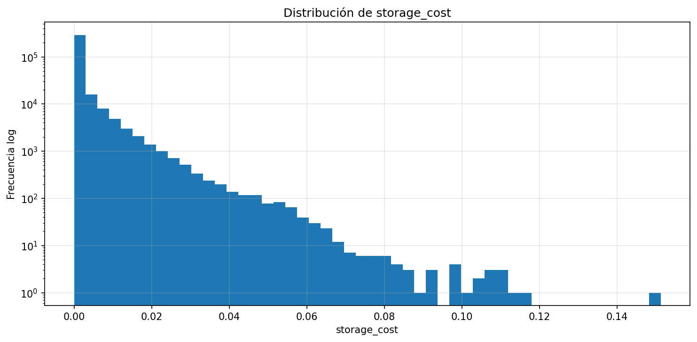
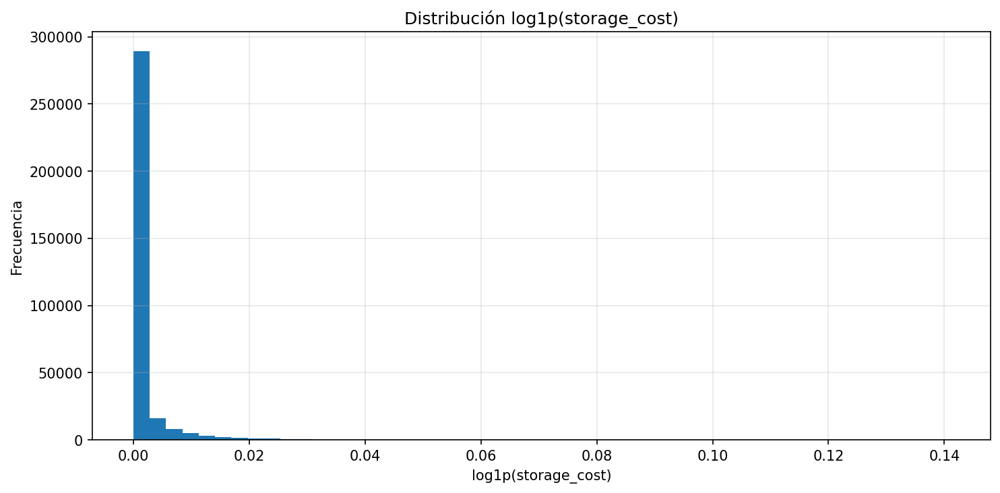
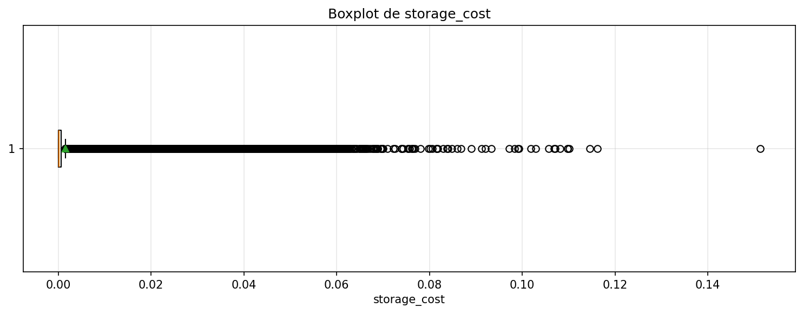
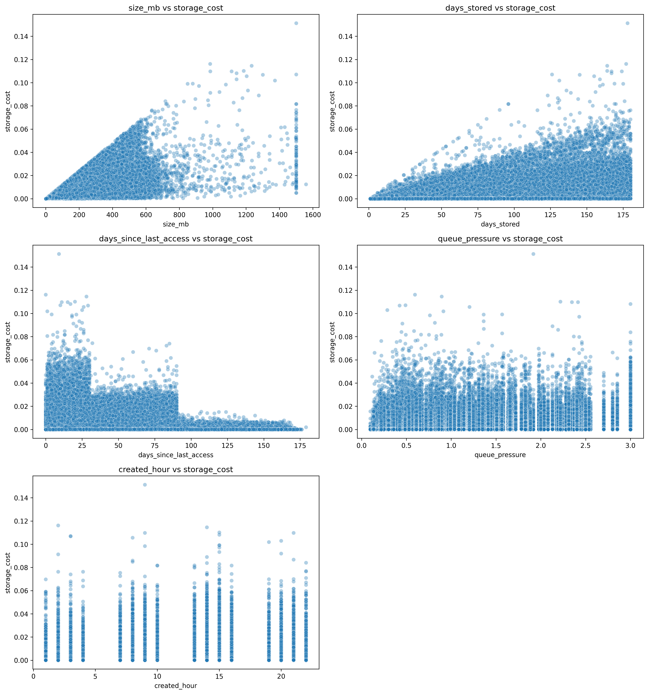
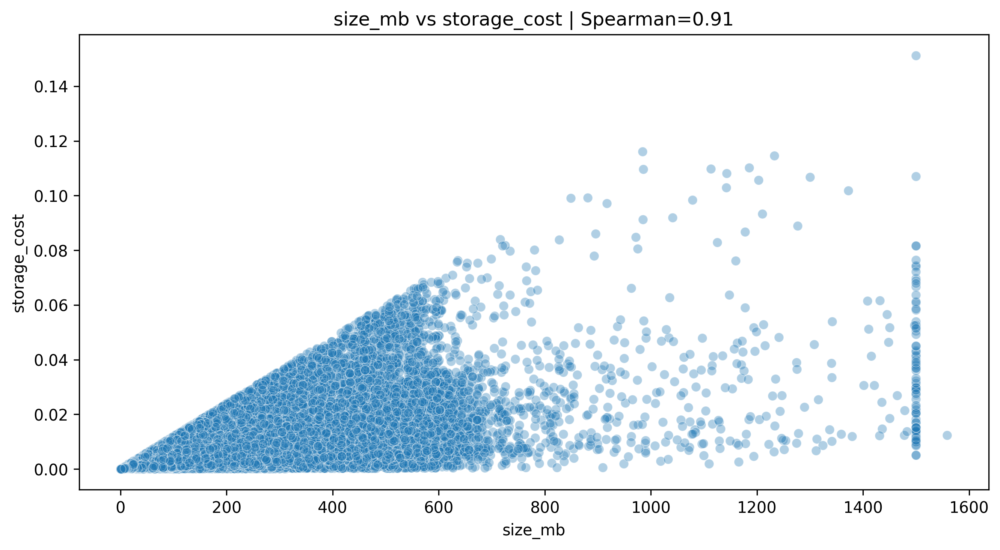
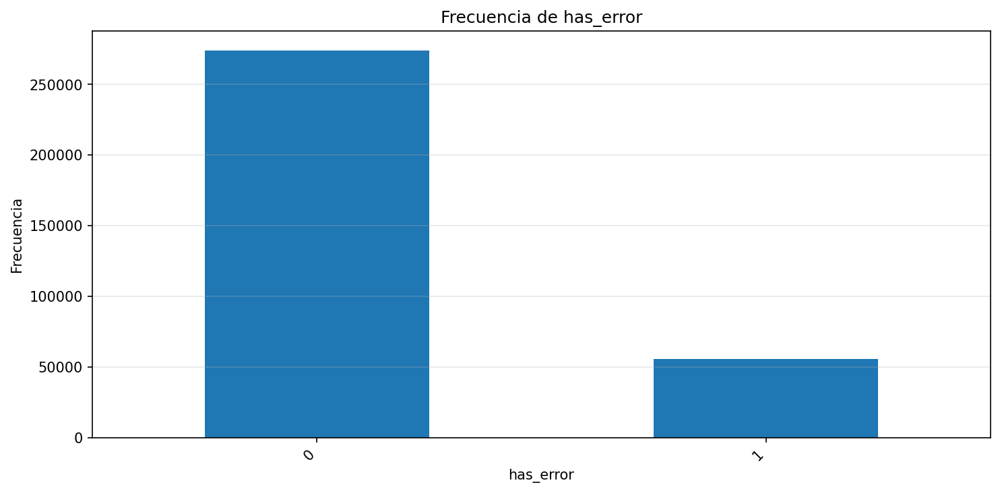
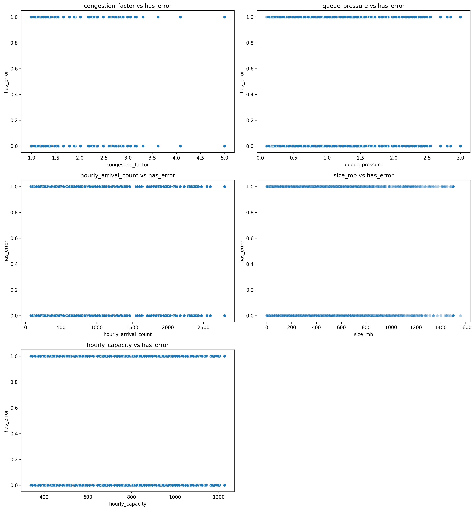

🏠 [Inicio](../README.md)

⬅️ [Dataset](03_estructura_dataset.md)
⬅️ [Variables Independientes](03_01_variables_independientes.md)
➡️ [Parámetros de Simulación](04_parametros_simulacion.md)

---

# Variables Dependientes del Sistema

## 1. Definición

Las variables dependientes representan los resultados observables a nivel de archivo dentro del sistema de almacenamiento.

A diferencia de un enfoque agregado por tiempo, este modelo define variables dependientes a nivel de **instancia (archivo)**, permitiendo:

* análisis estadístico directo
* modelamiento con machine learning
* construcción posterior de métricas agregadas

---

## 2. Principio de Modelado

El modelo se construye a nivel micro (archivo), donde:

* cada observación representa una unidad de almacenamiento
* las variables dependientes capturan el resultado del comportamiento del sistema

> Las variables agregadas del sistema se derivan a partir de estas variables.

---

## 3. Variables Dependientes Definidas

---

### 3.1 Costo de almacenamiento (`storage_cost`)

Representa:

* impacto económico por archivo
* efecto combinado de tamaño, tiempo y tipo de almacenamiento

---

#### 📊 Evidencia descriptiva

---

#### 📊 Evidencia multivariable

---

#### 🧠 Interpretación

* Distribución altamente asimétrica (cola larga)
* Fuerte dependencia de:

  * tamaño
  * tiempo
  * nivel de almacenamiento

---

#### 📈 Valores esperados vs observados

| Comportamiento        | Esperado  | Observado      |
| --------------------- | --------- | -------------- |
| Relación costo-tamaño | Positiva  | ✔ Confirmado   |
| Relación costo-tiempo | Creciente | ✔ Confirmado   |
| Diferencia por tier   | Alta      | ✔ Confirmado   |
| Distribución normal   | No        | ✔ No se cumple |

---

#### 👉 Implicación en modelamiento

* No usar OLS en escala original
* Usar:

  * GLM Gamma
  * modelos log-lineales

---

### 3.2 Estado de calidad del archivo

Variables:

* `has_error`
* `is_duplicate`
* `is_orphan`

---

#### 📊 Evidencia descriptiva

---

#### 📊 Evidencia multivariable

---

#### 🧠 Interpretación

* Eventos poco frecuentes
* Distribución desbalanceada

---

#### 📈 Valores esperados vs observados

| Comportamiento             | Esperado | Observado    |
| -------------------------- | -------- | ------------ |
| Baja frecuencia de errores | Sí       | ✔ Confirmado |
| Relación con variables     | Posible  | ✔ Parcial    |
| Distribución balanceada    | No       | ✔ No         |

---

#### 👉 Implicación en modelamiento

* Problema de clasificación desbalanceada
* Métrica clave:

  * Recall
* Ajuste necesario:

  * threshold

---

### 3.3 Estado operativo

Variables:

* `is_moved`
* `is_active`

---

#### 📊 Evidencia multivariable

---

#### 🧠 Interpretación

* Relacionadas con dinámica operativa del sistema
* Influenciadas por carga, tiempo y condiciones de red

---

#### 📈 Valores esperados vs observados

| Comportamiento             | Esperado | Observado    |
| -------------------------- | -------- | ------------ |
| Dependencia de condiciones | Sí       | ✔ Confirmado |
| Variabilidad operativa     | Alta     | ✔ Confirmado |

---

#### 👉 Implicación

* Variables útiles para:

  * análisis de performance
  * optimización operativa

---

## 4. Variables derivadas a nivel sistema

A partir de las variables anteriores:

### 4.1 Costo total

$$
C_{total} = \sum storage_{cost}
$$

---

### 4.2 Tasa de error

$$
error_rate = \frac{\sum has_error}{N}
$$

---

### 4.3 Estado del sistema

* volumen total
* redundancia
* eficiencia

---

## 5. Uso en el modelo

Las variables dependientes permiten:

### Regresión

$$
Y = storage_{cost}
$$

---

### Clasificación

$$
Y = has_error
$$

---

## 6. Relación con el sistema real

En entornos empresariales:

* el costo se factura agregado
* pero se genera a nivel archivo

Este modelo permite:

* explicar costos
* simular escenarios
* optimizar decisiones

---

## 7. Principio clave

> El sistema no se modela directamente: se modelan sus componentes, y el comportamiento global emerge de su agregación.

---

## 8. Conclusión

Las variables dependientes permiten:

* cuantificar comportamiento del sistema
* validar decisiones de modelamiento
* conectar datos con impacto real (costo)

---

🏠 [Inicio](../README.md)

⬅️ [Dataset](03_estructura_dataset.md)
⬅️ [Variables Independientes](03_01_variables_independientes.md)
➡️ [Parámetros de Simulación](04_parametros_simulacion.md)

---
