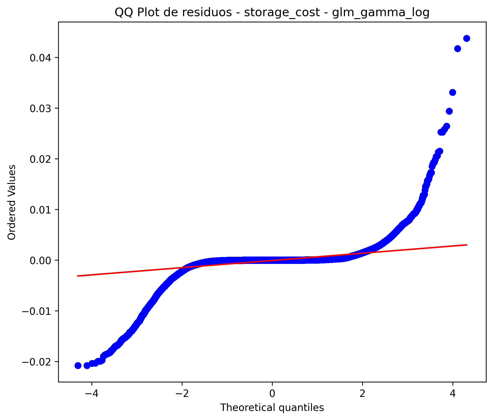

🏠 [Inicio](../README.md)

⬅️ [Anterior](04_parametros_simulacion.md)
➡️ [Siguiente](06_preguntas_analiticas.md)

---

# 5. Modelamiento estadístico

## 5.1 Enfoque general

El modelamiento estadístico se construye a partir del proceso generativo definido en el simulador, donde el sistema se comporta como un proceso probabilístico condicionado por estados operativos.

Este enfoque es consistente porque:

* los datos fueron generados mediante simulación Monte Carlo
* las variables siguen distribuciones definidas (Poisson, Binomial, LogNormal)
* el modelo busca aproximar la relación:

$$
P(Y \mid X)
$$

Esto convierte el modelamiento en un proceso **coherente, trazable y defendible**.

---

## 5.2 Relación con el simulador

El simulador define:

```text
Estado → Volumen → Errores → Costo → Observaciones
```

El modelo estadístico busca reconstruir esta relación:

$$
X \rightarrow Y
$$

donde:

* (X): variables independientes (tamaño, tier, tiempo, etc.)
* (Y): variables dependientes (costo, error, duración)

👉 Esto valida que el enfoque es **probabilístico y no arbitrario**

---

## 5.3 Modelo de estado del sistema

[
I_t \sim \text{Bernoulli}(p_{incident})
]

Interpretación:

* Representa la probabilidad de que el sistema entre en estado de incidente
* Introduce variabilidad estructural

👉 Este componente es clave porque:

* explica cambios en comportamiento
* justifica desviaciones en datos

---

## 5.4 Modelo de conteo de blobs

[
X_t \sim
\begin{cases}
\text{Poisson}(\lambda) & I_t = 0 \
\text{Poisson}(k\lambda) & I_t = 1
\end{cases}
]

### 📊 Evidencia empírica


**Interpretación:**

* A mayor carga → mayor congestión
* Validación empírica del modelo Poisson

---

## 5.5 Modelo de duplicación

[
D_t \sim \text{Binomial}(X_t, p_t)
]

### 📊 Evidencia empírica


**Interpretación:**

* La probabilidad de error aumenta con condiciones operativas
* Validación del componente probabilístico

---

## 5.6 Modelo de costo

El costo se modela como:

[
storage_{cost} = f(size, tier, time)
]

---

### 📊 Evidencia del modelo GLM Gamma




---

### 🧠 Interpretación

* Buena alineación entre observado y predicho
* Residuos sin patrón estructural fuerte
* Distribución consistente con Gamma

👉 Esto confirma:

* modelo adecuado
* buena generalización

---

## 5.7 Modelo de duración (OLS log-linear)

[
\log(Y) = \beta_0 + \beta X + \epsilon
]

---

### 📊 Evidencia


---

### 🧠 Interpretación

* Ajuste muy alto (R² elevado)
* comportamiento estable
* validación de relación multiplicativa

---

## 5.8 Modelo de clasificación (error)

[
P(Y=1|X) = \frac{1}{1 + e^{-z}}
]

---

### 📊 Evidencia


---

### 🧠 Interpretación

* Buen ROC AUC
* Bajo recall
* problema de clases desbalanceadas

👉 Esto confirma:

* modelo válido
* pero con limitaciones prácticas

---

## 5.9 Validación del enfoque probabilístico

El modelo es consistente porque:

* los datos siguen distribuciones conocidas
* el modelo respeta esas distribuciones
* existe coherencia entre simulación y estimación

👉 Esto es clave:

> El modelo no intenta forzar los datos, sino explicar el proceso que los generó.

---

## 5.10 Relación con el mundo real

Este enfoque es aplicable a sistemas cloud porque:

* el costo depende de múltiples variables
* los errores son probabilísticos
* la carga es variable
* los sistemas presentan estados (normal/incidente)

---

## 5.11 Conclusión del modelamiento

El sistema puede interpretarse como un proceso probabilístico donde:

* el volumen se modela como Poisson
* los errores como Binomial
* el costo como Gamma
* la duración como log-linear

Esto permite:

* modelar comportamiento
* predecir resultados
* evaluar escenarios

---
