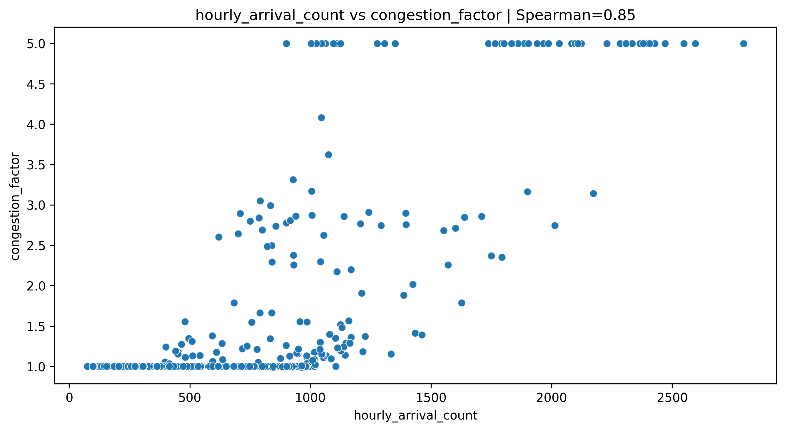
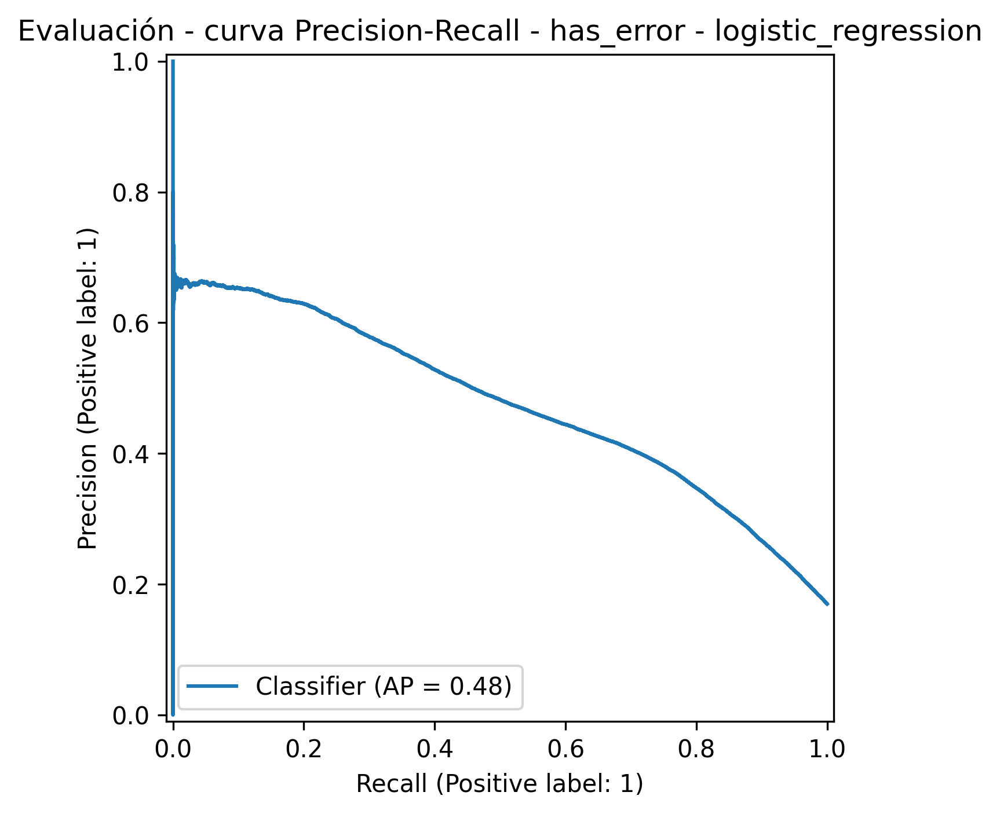
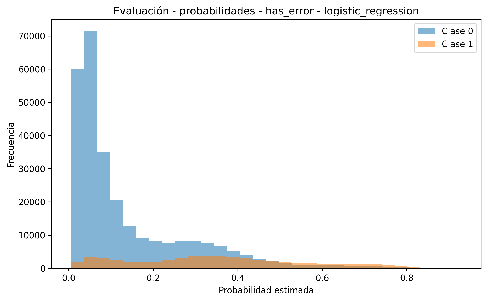
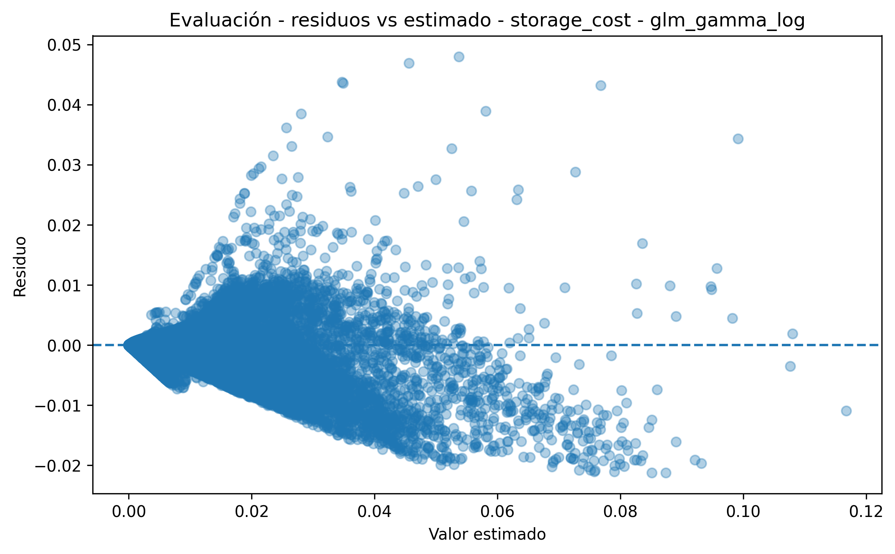
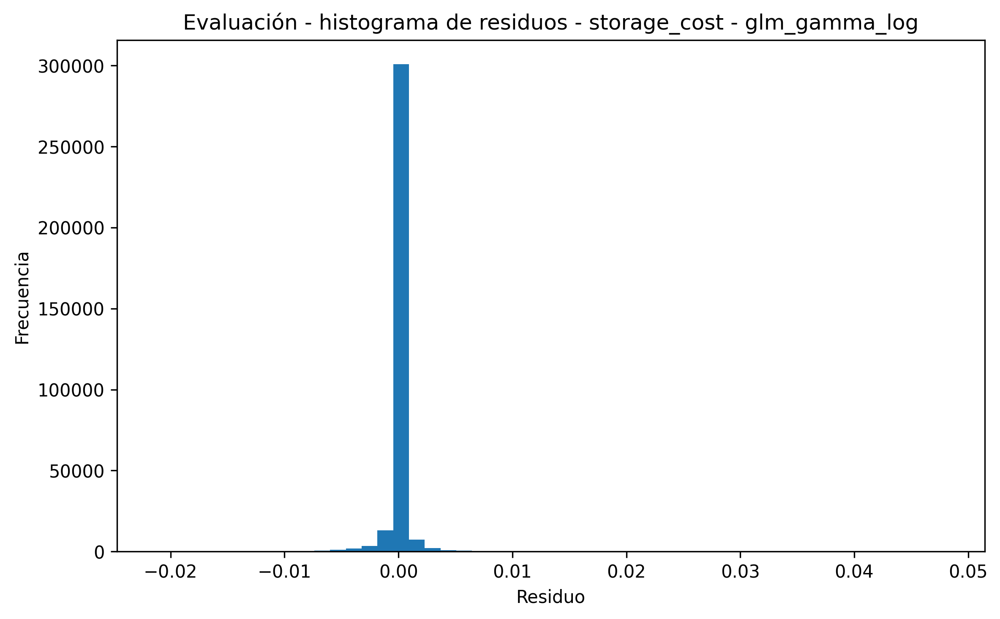
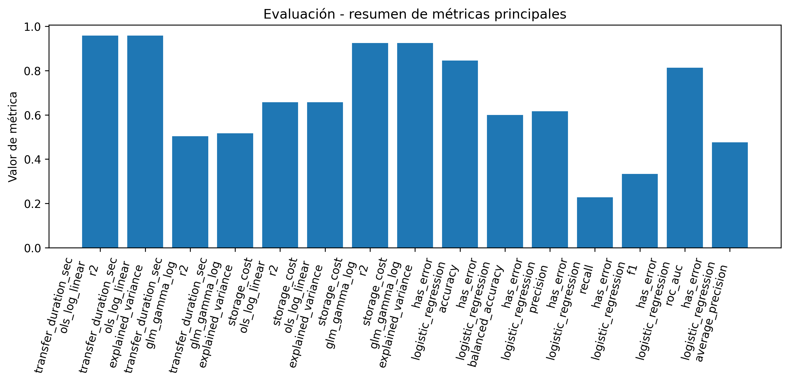
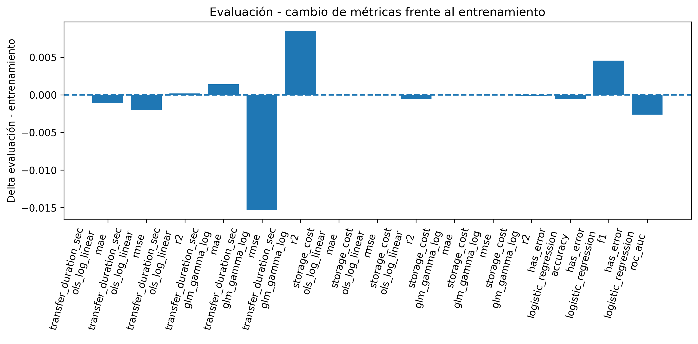

🏠 [Inicio](../README.md)

⬅️ [Anterior](05_modelamiento_estadistico.md)
➡️ [Siguiente](07_limitaciones_metodologia.md)

---

# 6. Preguntas analíticas

Las preguntas analíticas permiten conectar el modelo estadístico con la toma de decisiones, validando si los patrones observados en los datos simulados son consistentes con el comportamiento esperado del sistema.

Cada pregunta se aborda mediante:

* formulación analítica
* evidencia empírica (modelamiento + evaluación)
* interpretación estadística
* implicación práctica

---

## 6.1 ¿Aumenta el volumen en condiciones de alta carga o incidente?

### 📌 Hipótesis

[
H_0: \mathbb{E}[X_t | I_t=1] = \mathbb{E}[X_t | I_t=0]
]

[
H_1: \mathbb{E}[X_t | I_t=1] > \mathbb{E}[X_t | I_t=0]
]

---

### 📊 Evidencia (evaluación)

---

### 🧠 Interpretación

* Se observa una relación positiva entre carga y congestión
* El sistema responde con incremento en volumen operativo

👉 Esto valida el supuesto del modelo Poisson condicionado

---

### 💼 Implicación

* Incrementos de volumen pueden indicar:

  * reintentos automáticos
  * reprocesos
  * degradación del sistema

---

## 6.2 ¿Aumenta la probabilidad de errores bajo condiciones de carga?

### 📌 Hipótesis

[
H_0: p_{fail} = p_{ok}
]

[
H_1: p_{fail} > p_{ok}
]

---

### 📊 Evidencia (evaluación)

---

### 🧠 Interpretación

* El modelo discrimina correctamente eventos de error (ROC alto)
* Sin embargo:

  * bajo recall
  * dificultad para detectar eventos raros

👉 Esto confirma:

* los errores son eventos poco frecuentes
* pero altamente relevantes

---

### 💼 Implicación

* los sistemas reales pueden:

  * fallar silenciosamente
  * subestimar errores
* se requiere ajuste de thresholds

---

## 6.3 ¿El costo puede predecirse de forma confiable?

### 📌 Hipótesis

[
H_0: \text{El modelo no captura la relación estructural}
]

[
H_1: \text{El modelo captura correctamente la relación}
]

---

### 📊 Evidencia (evaluación)

---

### 🧠 Interpretación

* Alta alineación entre valores observados y predichos
* Residuos sin patrón sistemático fuerte
* distribución consistente con GLM Gamma

👉 Validación fuerte del modelo

---

### 💼 Implicación

* el costo puede estimarse antes de ejecutarse
* permite:

  * planificación financiera
  * optimización de almacenamiento

---

## 6.4 ¿La duración de transferencia es estable y predecible?

### 📊 Evidencia (evaluación)

---

### 🧠 Interpretación

* Modelo altamente estable
* errores bajos
* comportamiento consistente

👉 Validación del modelo OLS log-linear

---

### 💼 Implicación

* permite:

  * estimar tiempos de transferencia
  * planificar operaciones
  * detectar cuellos de botella

---

## 6.5 ¿Los modelos generalizan a nuevos datasets?

### 📊 Evidencia clave

---

### 🧠 Interpretación

* No hay degradación significativa
* comportamiento consistente entre:

  * modelamiento
  * evaluación

👉 evidencia de generalización

---

### 💼 Implicación

* los modelos pueden aplicarse en producción
* bajo condiciones similares

---

## 6.6 ¿Existe sobreajuste en los modelos?

### 📊 Evidencia

* comparación modelamiento vs evaluación
* estabilidad de métricas
* comportamiento de residuos

---

### 🧠 Interpretación

* no se observa sobreajuste significativo
* los modelos capturan patrones estructurales

---

### 💼 Implicación

* el modelo es robusto
* no depende de ruido del dataset

---

## 6.7 Conclusión analítica

Las preguntas analíticas permiten demostrar que:

* el sistema responde a condiciones de carga
* los errores son eventos raros pero críticos
* el costo es altamente predecible
* la duración es estable
* los modelos generalizan correctamente

Esto confirma que:

> El enfoque probabilístico basado en simulación es válido para modelar sistemas de almacenamiento cloud.

---
