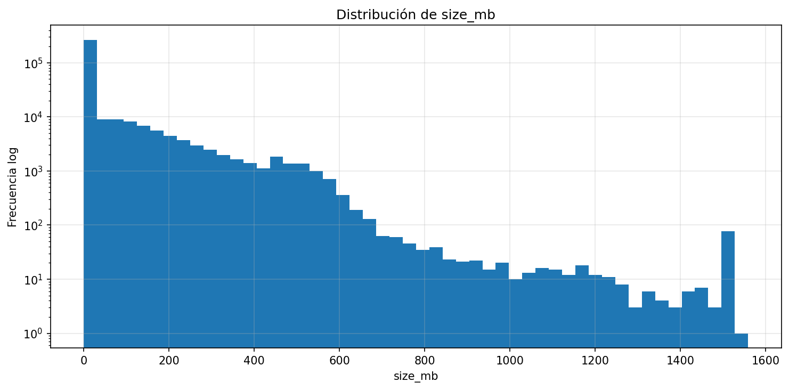
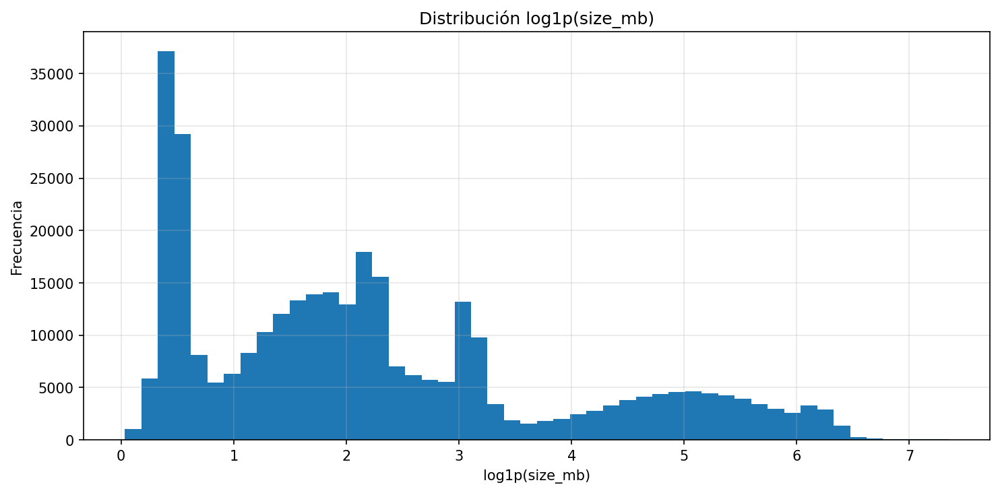
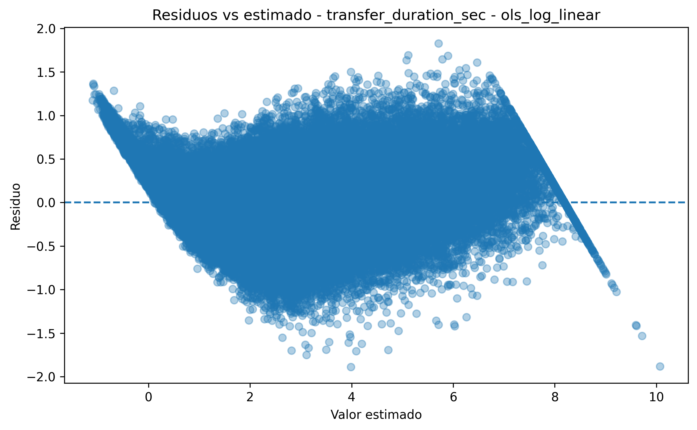
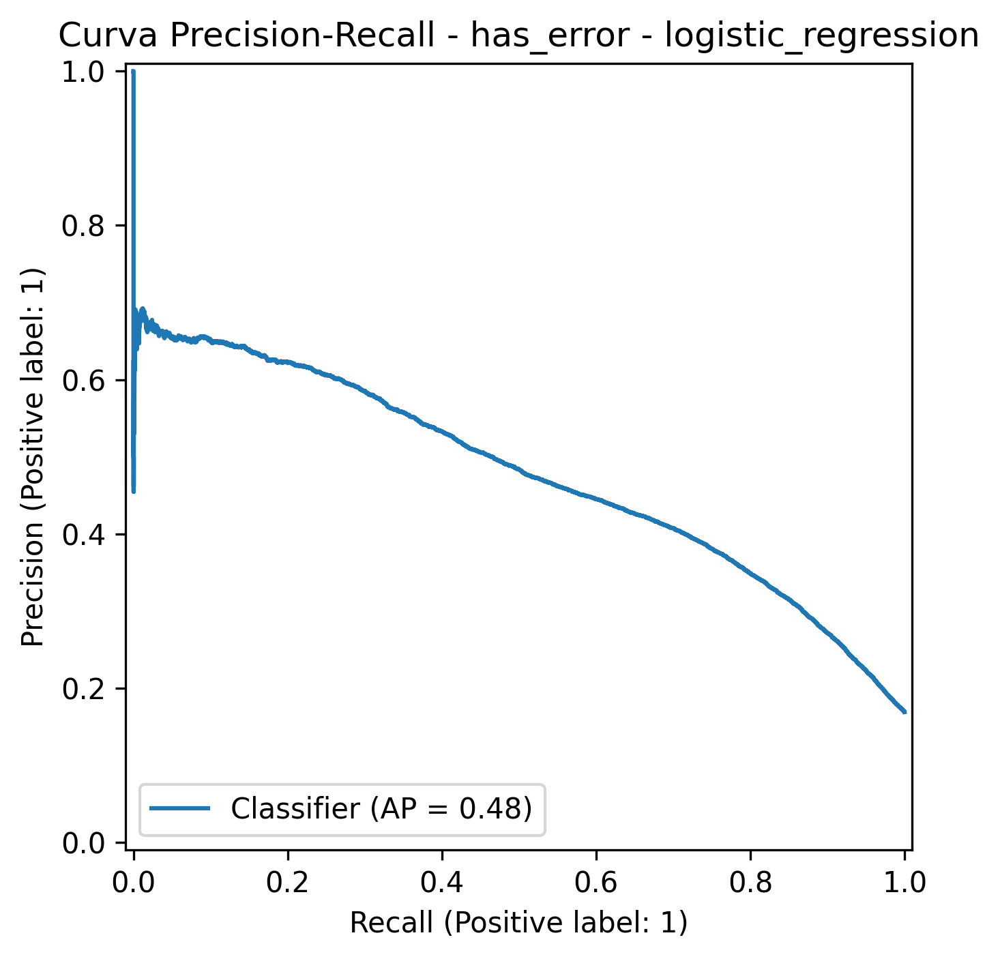
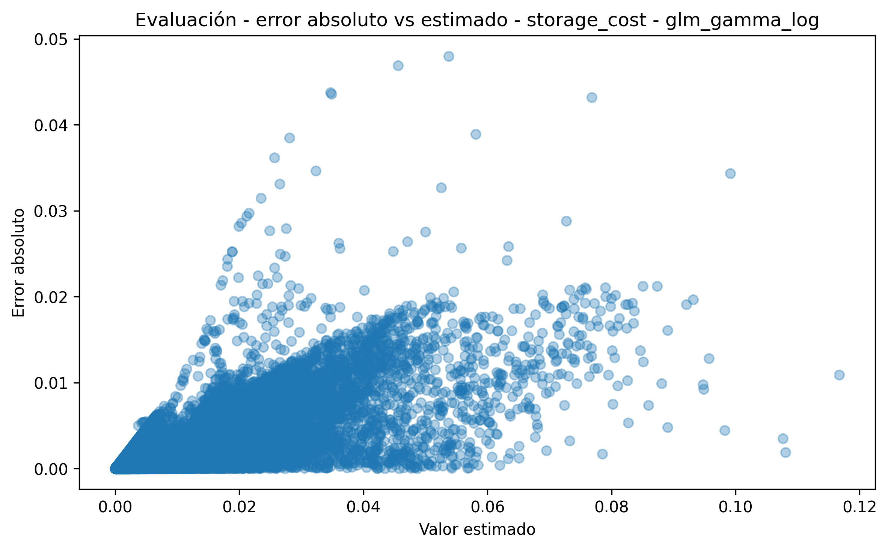
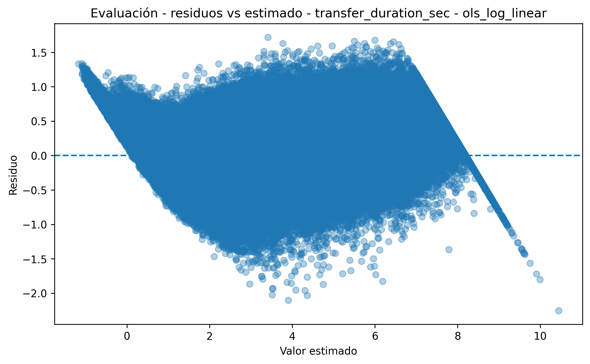
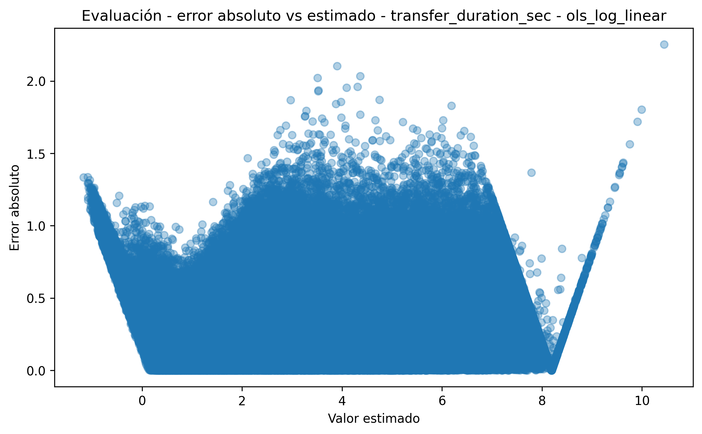

🏠 [Inicio](../README.md)

⬅️ [Anterior](06_preguntas_analiticas.md)
➡️ [Siguiente](08_validaciones_calidad.md)

---

# 7. Limitaciones y consideraciones metodológicas

## 7.1 Naturaleza sintética del dataset

El modelo se basa en datos generados mediante simulación controlada y no en datos productivos reales.

Esto implica que los resultados no deben interpretarse como una representación exacta de un entorno empresarial específico, sino como una aproximación experimental diseñada para estudiar relaciones entre variables bajo condiciones conocidas.

### Limitaciones

* No se capturan patrones particulares de negocio.
* No se incorporan políticas reales de gobierno de datos.
* No se modelan restricciones regulatorias.
* No se incluyen configuraciones reales de infraestructura.
* No se consideran costos comerciales exactos de proveedor cloud.

### Valor metodológico

A pesar de estas limitaciones, la simulación permite:

* controlar parámetros;
* repetir experimentos;
* generar datasets comparables;
* validar hipótesis;
* evaluar modelos sin depender de datos sensibles o privados.

---

## 7.2 Dependencia de los parámetros del simulador

Los resultados dependen directamente de los parámetros usados en el simulador, tales como:

* número de archivos generados;
* distribución de tamaños;
* distribución de tipos de archivo;
* probabilidad de errores;
* configuración temporal de carga;
* niveles de almacenamiento;
* tiempo de permanencia.

Por tanto, los resultados son válidos **dentro del universo simulado**.

### Tabla 1. Parámetros críticos y efecto esperado

| Parámetro             | Riesgo si está mal calibrado | Efecto en resultados                         |
| --------------------- | ---------------------------- | -------------------------------------------- |
| Tamaño de archivos    | Subestimar archivos grandes  | Menor costo estimado                         |
| Probabilidad de error | Subestimar fallas            | Bajo recall en clasificación                 |
| Distribución de tiers | Sesgo en costos              | GLM puede capturar una estructura artificial |
| Carga horaria         | No representar congestión    | Duración demasiado estable                   |
| Tiempo almacenado     | Subestimar lifecycle         | Menor costo acumulado                        |

---

## 7.3 Limitaciones en la distribución de tamaños

El tamaño de archivos se modela con una distribución asimétrica, coherente con escenarios de almacenamiento donde predominan archivos pequeños y existen pocos archivos grandes.

### Evidencia descriptiva





### Consideración metodológica

La asimetría observada justifica transformaciones logarítmicas y modelos no normales. Sin embargo, si en un entorno real la distribución de tamaños cambia, el desempeño de los modelos también puede variar.

---

## 7.4 Limitaciones del modelo de costo

El costo de almacenamiento se calcula a partir de una relación estructural entre:

* tamaño;
* tiempo almacenado;
* nivel de almacenamiento.

$$
storage_cost =
size_{gb} \cdot rate_{tier} \cdot \frac{days_{stored}}{30}
$$

### Evidencia descriptiva


### Evidencia de modelamiento


### Limitación

Aunque el GLM Gamma captura bien la estructura positiva y asimétrica del costo, el modelo no incluye todos los componentes reales de facturación cloud, como:

* operaciones de lectura y escritura;
* transferencia de salida;
* replicación geográfica;
* snapshots;
* versionamiento;
* costos por recuperación desde archive;
* descuentos comerciales o reservas.

Por tanto, el modelo estima una aproximación del costo, no una factura real completa.

---

## 7.5 Limitaciones del modelo de duración

La duración de transferencia se modela como una variable continua positiva, con comportamiento multiplicativo.

### Evidencia de modelamiento




### Limitación

El modelo puede capturar adecuadamente la relación entre tamaño y duración en el dataset simulado, pero no incorpora todos los factores reales que afectan la transferencia, tales como:

* latencia de red;
* congestión regional;
* throttling del proveedor;
* variabilidad por cliente;
* concurrencia;
* límites de cuenta;
* configuración de red privada o pública.

Por esta razón, la duración estimada debe interpretarse como una aproximación estadística bajo condiciones controladas.

---

## 7.6 Limitaciones del modelo de clasificación de errores

La ocurrencia de errores se modela como un problema de clasificación binaria.

### Evidencia descriptiva


### Evidencia de modelamiento




### Limitación principal

El modelo logístico puede presentar buena capacidad discriminativa global, pero bajo recall.

Esto significa que:

* el modelo ordena razonablemente bien los casos según riesgo;
* pero puede dejar sin detectar una proporción importante de errores reales;
* el threshold por defecto puede no ser el más adecuado.

### Implicación

En un escenario operativo real, un bajo recall puede ser crítico porque los errores no detectados pueden generar:

* duplicidad no controlada;
* costos innecesarios;
* pérdida de calidad;
* reprocesos;
* fallos silenciosos.

---

## 7.7 Limitaciones por desbalance de clases

Los errores suelen tener baja frecuencia. Esto genera un problema de clasificación desbalanceada.

### Tabla 2. Efecto del desbalance

| Aspecto               | Consecuencia                               |
| --------------------- | ------------------------------------------ |
| Pocos casos positivos | Dificultad para aprender patrones de error |
| Accuracy alta         | Puede ser engañosa                         |
| Recall bajo           | Errores no detectados                      |
| Precision variable    | Riesgo de falsos positivos                 |
| Threshold fijo        | Puede no servir operativamente             |

### Mitigaciones futuras

* ajuste de threshold;
* ponderación de clases;
* oversampling;
* undersampling;
* modelos no lineales;
* métricas costo-sensibles.

---

## 7.8 Supuesto de independencia entre observaciones

El modelo asume que cada archivo puede tratarse como una observación independiente.

Sin embargo, en sistemas reales pueden existir dependencias por:

* lotes de carga;
* procesos batch;
* reintentos masivos;
* fallas regionales;
* usuarios o aplicaciones específicas;
* ventanas horarias.

### Limitación

Este supuesto puede subestimar la varianza real del sistema, especialmente en escenarios de incidentes o congestión.

---

## 7.9 Supuesto de independencia temporal

La simulación puede generar cargas por franjas horarias o días, pero no necesariamente modela memoria temporal compleja.

En sistemas reales, los incidentes pueden tener:

* persistencia;
* recuperación gradual;
* efecto acumulado;
* autocorrelación;
* propagación entre servicios.

### Extensión futura

Una mejora posible sería modelar el estado del sistema como:

$$
I_t \sim Markov(I_{t-1})
$$

en lugar de asumir eventos independientes.

---

## 7.10 Posible sobredispersión

El modelo Poisson supone:

$$
Var(X_t) = E(X_t)
$$

Pero en sistemas reales puede ocurrir:

$$
Var(X_t) > E(X_t)
$$

Esto puede deberse a:

* picos de tráfico;
* burst patterns;
* procesos concurrentes;
* reprocesos;
* incidentes acumulados.

### Mitigación

Si se detecta sobredispersión, una alternativa es usar:

* Binomial Negativa;
* modelos Poisson inflados en ceros;
* modelos jerárquicos;
* modelos de series temporales.

---

## 7.11 Limitaciones del uso de hash

El modelo incorpora `hash_head` y `hash_tail` como aproximaciones de contenido.

Estas variables funcionan como proxies de:

* recurrencia;
* persistencia;
* duplicidad probable.

### Limitaciones

* Alta cardinalidad.
* Baja interpretabilidad.
* Sensibilidad extrema a cambios mínimos.
* No equivale a hash completo.
* No representa semántica del archivo.

### Interpretación correcta

El hash no debe interpretarse como causa económica del costo, sino como una variable auxiliar para análisis estructural y detección de duplicados.

---

## 7.12 Exclusión de optimizaciones reales de almacenamiento

El modelo no incluye mecanismos internos como:

* compresión;
* deduplicación física;
* almacenamiento incremental;
* versionamiento optimizado;
* políticas automáticas de lifecycle;
* tiering administrado por proveedor.

Esto implica que el costo modelado corresponde principalmente a una aproximación de almacenamiento bruto.

---

## 7.13 Limitaciones en la transferencia simulación-realidad

La evaluación con dataset nuevo permite verificar estabilidad dentro del mismo proceso generador, pero no garantiza desempeño idéntico con datos reales.

### Evidencia de evaluación


### Interpretación

Si no existe degradación significativa entre modelamiento y evaluación, se puede afirmar que los modelos generalizan dentro del entorno simulado.

Sin embargo, no se puede afirmar automáticamente que generalicen a producción sin calibración adicional.

---

## 7.14 Limitaciones en evaluación del modelo de costo

### Evidencia de evaluación




### Interpretación

La estabilidad del modelo de costo en evaluación sugiere que el GLM Gamma captura correctamente la estructura simulada.

La limitación es que esta estructura depende de la fórmula de costo definida en el simulador.

---

## 7.15 Limitaciones en evaluación del modelo de duración

### Evidencia de evaluación






### Interpretación

La estabilidad del modelo sugiere que la duración sigue una estructura multiplicativa bien capturada por OLS log-linear.

La limitación es que no se modelan todos los factores de red o infraestructura reales.

---

## 7.16 Limitaciones en evaluación del modelo logístico

### Evidencia de evaluación


### Interpretación

El modelo logístico puede mantener un ROC AUC aceptable, pero la matriz de confusión y la curva Precision-Recall son más relevantes cuando existe desbalance.

La principal limitación no es la capacidad de ordenar riesgos, sino la capacidad de detectar suficientes positivos.

---

## 7.17 Consideraciones de escalabilidad

El enfoque está diseñado para escalar porque trabaja con:

* metadatos;
* agregaciones;
* variables derivadas;
* hashes parciales;
* modelos interpretables.

Sin embargo, a mayor volumen pueden aparecer problemas como:

* mayor cardinalidad;
* mayor dispersión;
* tiempos de procesamiento más altos;
* necesidad de procesamiento distribuido;
* data drift.

---

## 7.18 Qué se puede afirmar y qué no

### Se puede afirmar

| Afirmación                                               | Soporte                                            |
| -------------------------------------------------------- | -------------------------------------------------- |
| Los modelos son consistentes dentro del entorno simulado | Evaluación con dataset nuevo                       |
| El costo es bien capturado por GLM Gamma                 | Gráficos observado vs predicho y residuos          |
| La duración es estable con OLS log-linear                | Evaluación y residuos                              |
| La clasificación requiere ajustes                        | Curvas ROC, Precision-Recall y matriz de confusión |

### No se puede afirmar

| Afirmación                                  | Motivo                      |
| ------------------------------------------- | --------------------------- |
| Que el modelo reemplaza datos reales        | Usa simulación              |
| Que predice facturación exacta cloud        | No incluye todos los costos |
| Que detecta todos los errores               | Recall limitado             |
| Que generaliza a producción sin calibración | Falta validación real       |

---

## 7.19 Conclusión metodológica

El modelo prioriza:

* claridad estructural;
* reproducibilidad;
* interpretabilidad;
* trazabilidad;
* capacidad de extensión.

Las limitaciones identificadas no invalidan el enfoque. Al contrario, delimitan su alcance y permiten entender bajo qué condiciones los resultados son válidos.

El principal valor metodológico del proyecto es que conecta:

```text
Simulación controlada → Modelamiento interpretable → Evaluación externa → Discusión crítica
```

Por tanto, el enfoque es válido para fines académicos, experimentales y de análisis comparativo, siempre que sus resultados no se presenten como predicciones exactas de un sistema productivo sin calibración adicional.

---
