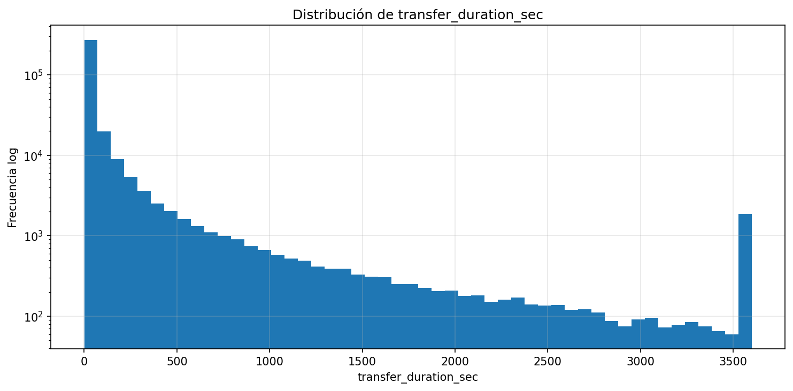
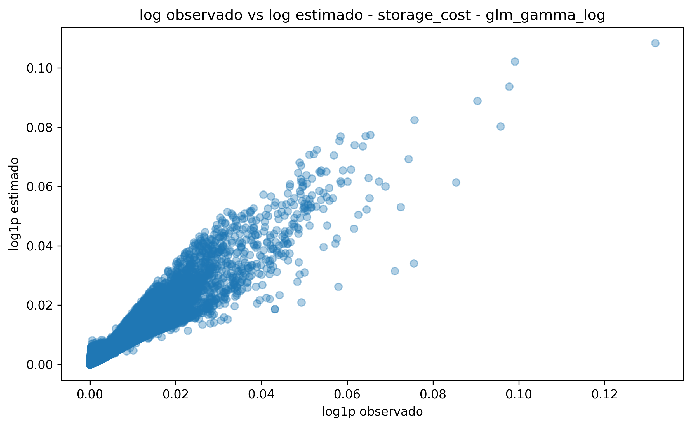
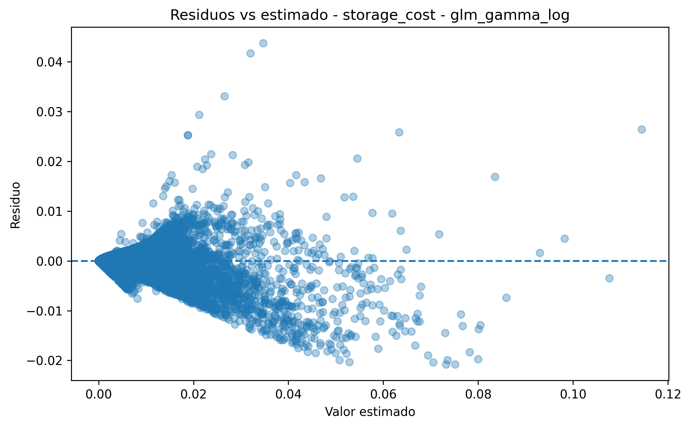
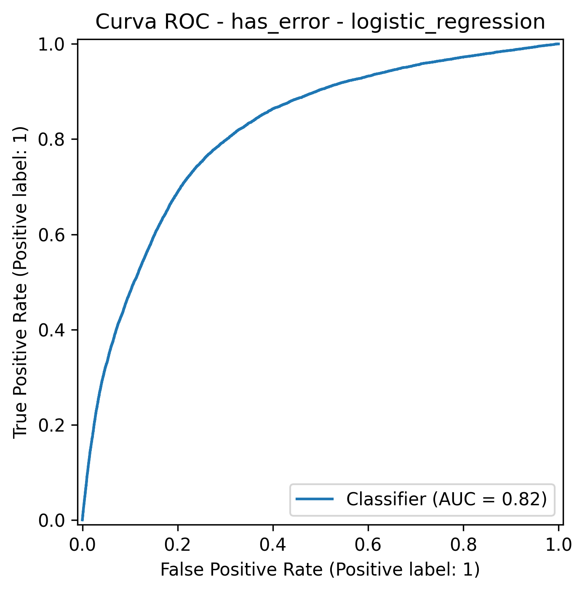
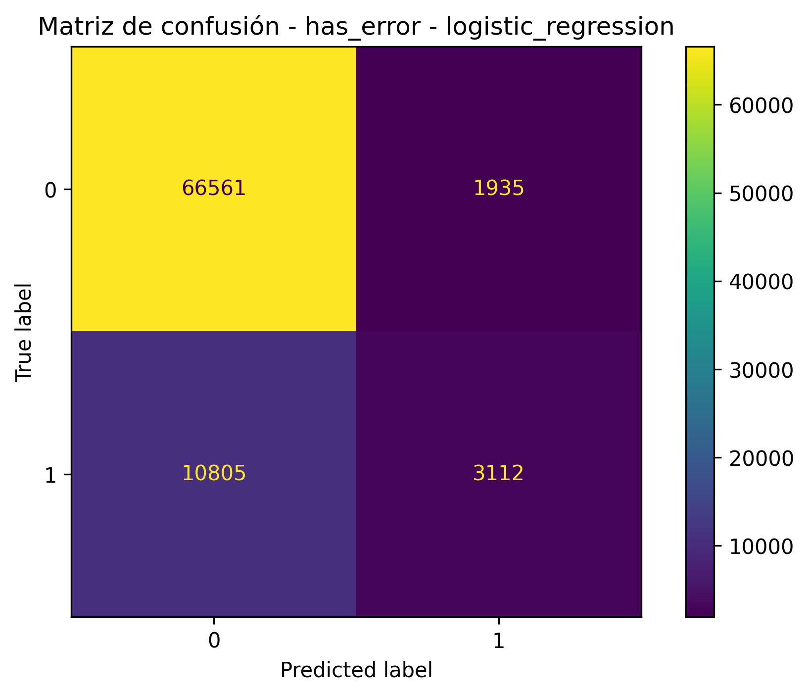
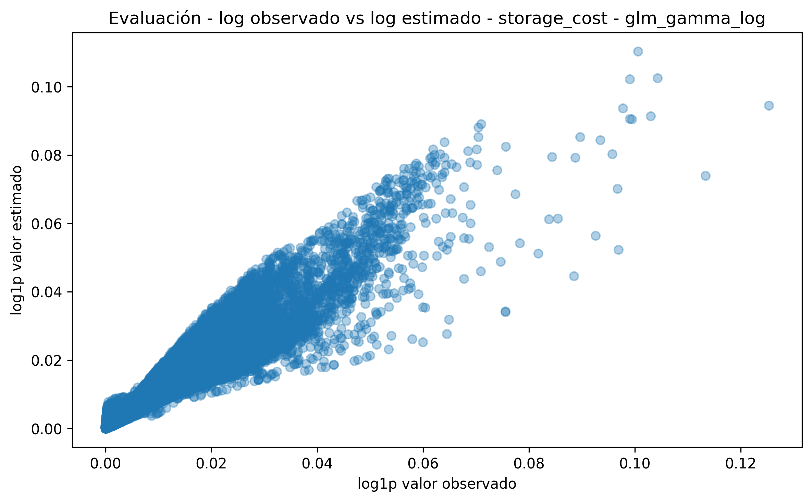
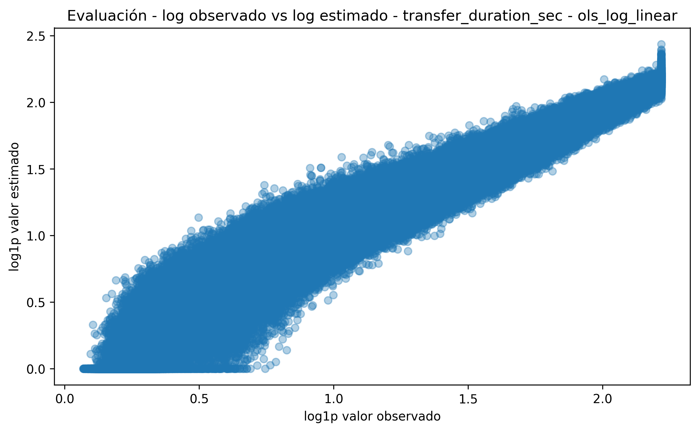
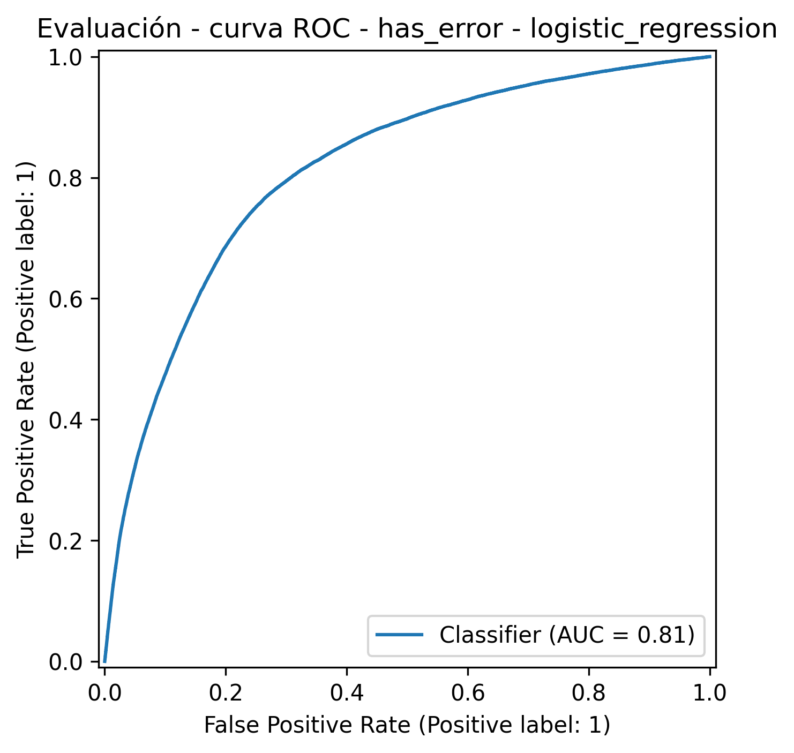
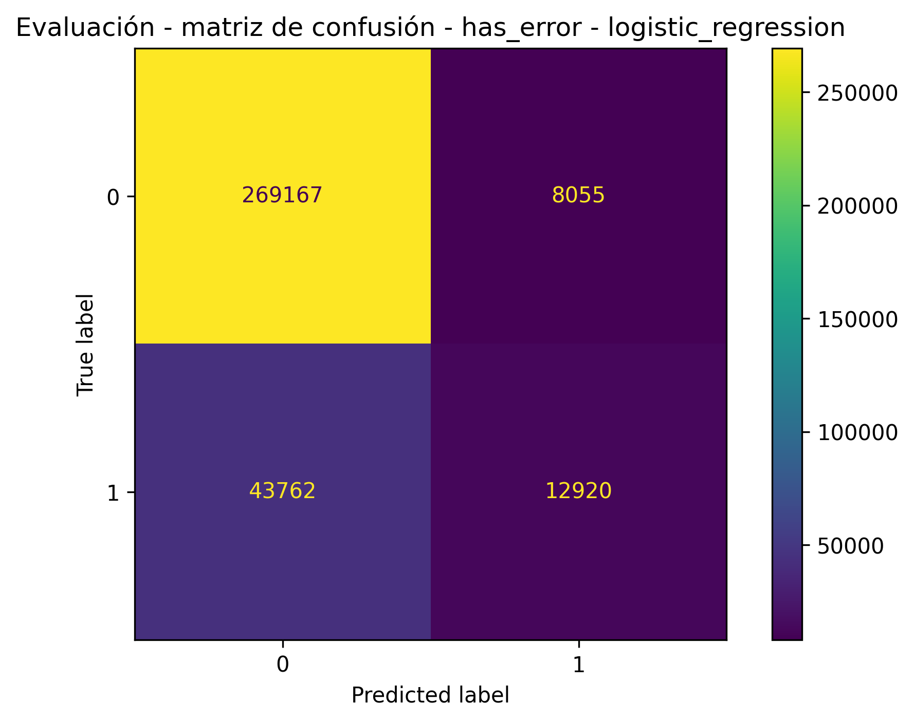

🏠 [Inicio](../README.md)

⬅️ [Anterior](07_limitaciones_metodologia.md)
➡️ [Siguiente](09_modelo_causal_fallas.md)

---

# 8. Validaciones de calidad

La validación de calidad es un componente crítico del proyecto, ya que permite verificar que:

* el dataset generado es consistente con el modelo probabilístico
* las relaciones entre variables son coherentes
* los modelos estadísticos capturan patrones estructurales
* los resultados generalizan a nuevos datasets

A diferencia de enfoques tradicionales, este proyecto incorpora **dos niveles de validación**:

```text
Simulación 1 → Dataset de modelamiento
Simulación 2 → Dataset de evaluación
```

Esto permite validar tanto la calidad interna como la capacidad de generalización.

---

## 8.1 Validaciones estructurales

Se verifica:

* `size_bytes >= 0`
* `content_hash` no nulo
* unicidad de `blob_id`
* coherencia temporal (`created_at`, `last_modified_at`)
* consistencia del `path`
* integridad de variables derivadas

Estas validaciones garantizan que el dataset sea **técnicamente consistente** antes del análisis.

---

## 8.2 Validación entre datasets (modelamiento vs evaluación)

El simulador genera datasets independientes bajo la misma lógica probabilística.

El objetivo no es replicar datos idénticos, sino validar que:

* las distribuciones se mantengan
* las relaciones estructurales persistan
* los modelos no pierdan desempeño

Esto permite afirmar que:

> El modelo aprende patrones estructurales, no ruido.

---

## 8.3 Validaciones descriptivas

Se analizan las distribuciones principales del dataset.

---

### 💰 Costo de almacenamiento


**Validación:**

* ✔ distribución asimétrica
* ✔ valores positivos
* ✔ presencia de cola larga

---

### ⏱️ Duración de transferencia



**Validación:**

* ✔ distribución no normal
* ✔ sesgo positivo

---

### ⚠️ Errores


**Validación:**

* ✔ eventos raros
* ✔ distribución desbalanceada

---

## 8.4 Validaciones multivariables

Se validan relaciones entre variables clave.

---

### 💰 Relación costo vs variables


**Validación:**

* ✔ costo aumenta con tamaño
* ✔ costo depende del tiempo
* ✔ diferencias por tier

---

### ⚠️ Relación errores


**Validación:**

* ✔ errores asociados a condiciones operativas
* ✔ comportamiento no lineal

---

### ⏱️ Relación duración


**Validación:**

* ✔ mayor tamaño → mayor duración
* ✔ variabilidad operativa

---

## 8.5 Validaciones del modelo (dataset de modelamiento)

Se evalúa el comportamiento de los modelos entrenados.

---

### 💰 Modelo GLM Gamma (costo)





**Validación:**

* ✔ buen ajuste
* ✔ residuos sin patrón fuerte
* ✔ coherencia con distribución Gamma

---

### ⏱️ Modelo OLS log-linear (duración)


**Validación:**

* ✔ alto ajuste (R² alto)
* ✔ estabilidad

---

### ⚠️ Modelo logístico (errores)





**Validación:**

* ✔ buen ROC AUC
* ⚠ bajo recall

---

## 8.6 Validaciones en dataset de evaluación (generalización)

Se evalúan los modelos sobre un dataset nuevo sin reentrenamiento.

---

### 💰 Evaluación costo



---

### ⏱️ Evaluación duración



---

### ⚠️ Evaluación errores





---

## 🧠 Interpretación clave

* No hay degradación significativa entre modelamiento y evaluación
* Los modelos mantienen comportamiento estable
* La simulación genera datasets consistentes

---

## 8.7 Validación del enfoque probabilístico

El sistema es coherente porque:

* el simulador define distribuciones
* los datos reflejan esas distribuciones
* los modelos respetan esas estructuras
* la evaluación confirma estabilidad

```text
Simulación → Datos → Modelo → Evaluación → Consistencia
```

---

## 8.8 Conclusión

Las validaciones muestran que:

* el dataset es estructuralmente consistente
* las relaciones entre variables son coherentes
* los modelos capturan patrones reales del sistema
* el enfoque generaliza a nuevos datasets

Esto permite afirmar que el pipeline completo es:

* reproducible
* consistente
* defendible
* alineado con un enfoque probabilístico

---
